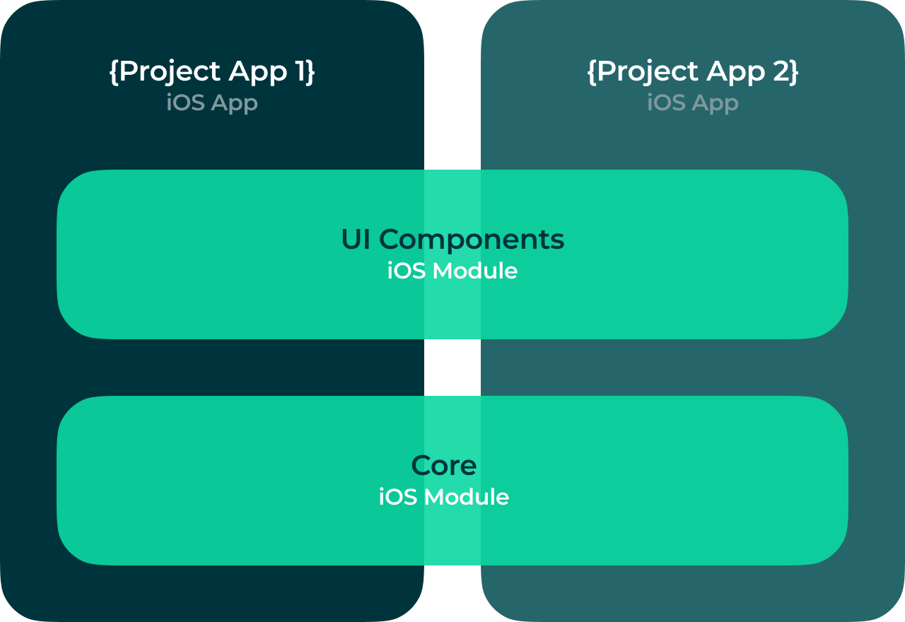

# `{Project Name}` iOS

- [Overview](#overview)
- [Getting Started](#getting-started)
- [Installation](#installation)
- [Conventions](#conventions)
- [Environments](#environments)
- [Troubleshooting](#troubleshooting)
- [Contributing](#contributing)
- [Releasing](#releasing)
- [Known Issues](#known-issues)

## Overview

*This document is a template for README files of any Koombea iOS project. Please use this as to enforce the project guidelines and conventions, as well as any other development process of the team. Replace this paragraph for a project introduction.*

## Getting Started

### Submodules

The apps are linked to 2 iOS modules which contains the core business logic and reusable UI components:

#### Core
iOS framework for main business logic. Its main purpose is to reuse common code between the iOS apps related to:

- Models
- Configuration
- Networking
- Base classes, structs and enums
- Access to 3rd party services

#### UIComponents
iOS framework for UI components. Its main purpose is to reuse common code between the all the iOS apps related to:

- Custom controls
- Theme components
- App appareance
- 3rd party UI components (E.g: Google maps)

## Installation

Use [Xcode](https://apps.apple.com/us/app/xcode/id497799835?mt=12) latest version to run this apps. This can be downloaded directly from the mac app store. Then open the `{Project Name}.xcodeproj` file and choose the scheme for the app you want to run as described in the [Environments](#environments) section.

### Dependencies

This project uses [Swift Package Manager](https://swift.org/package-manager/) as its main dependency manager as well as [Carthage](https://github.com/Carthage/Carthage) as an alternative dependency manager for those libraries that doesn't have support for SPM. However there are some dependecies linked manually which don't support SPM nor Carthage.

The list of project dependencies can be found at the `{Project Name}.xcodeproj` using Xcode and navigating to Project > Package Dependencies.

Before adding any new library to the project, a state-of-the-art analysis has to be done. Use the [libraries decision matrix log]({Document-URL}) to keep track of the options available at a the moment and the decision making process.

The _Technical Lead_ will be responsible for choosing the one that is best suited for the project before integrate it.

### Distribution

The alpha versions of this app are distributed using Firebase Distribution. An the beta builds and productions builds using Apple Testflight and App Store services.

## Conventions

As a best practice follow these guidelines:

1. Follow [Swift's API design guidelines](https://www.swift.org/documentation/api-design-guidelines/) for naming conventions.
2. Follow Ray Wenderlich's [Swift Style Guide](https://github.com/raywenderlich/swift-style-guide) for coding style.
3. Use [SwiftLint](https://github.com/realm/SwiftLint) to enforce the project's Swift style and conventions.conventions. This requires a binary to be installed in your machine. See more [here](https://github.com/realm/SwiftLint/blob/master/README.md#installation) for installation instructions.
4. Use [semantic versioning](https://semver.org) for any beta or production releases.
5. Use Git Flow as your git workflow and branch naming convention. For more information, see our [contributing](CONTRIBUTING.md) guide.

## Environments

This project has different Xcode schemes to run the app pointing to different environments:

### Production

Use the following for _App Store_ releases:

- `{Project Name} Prod` (Xcode scheme)
- Backend: [Backend]({Backend-URL})
- Error tracking: [Crashlytics]({Crashlytics-URL})

### Staging

Use the following for _testing_ releases:

- `{Project Name} Stag` (Xcode scheme)
- Backend: [Backend]({Backend-URL})
- Error tracking: [Crashlytics]({Crashlytics-URL})

### Development

Use the following Xcode schemes for _development_ or running the app locally:

- `{Project Name} Dev` (Xcode scheme)
- Backend: [Backend]({Backend-URL})
- Error tracking: [Crashlytics]({Crashlytics-URL})

## Troubleshooting

### Logs

Debug logs will be output to the Xcode's console. To intercept network requests you can use some tools like [Proxyman](https://proxyman.io). Remote logs would be available in the error tracking service for each environment as described in the [Environments](#environments) section.

[Add any additional instuctions to access the logs]: text

### Certificate issues

To be able to run the apps on devices directly from Xcode you will need a development certificate and mobile provisioning files installed in your machine. Those can be obtained from the [Apple Developer portal](http://developer.apple.com/account/).

## Contributing

The `main` branch of this repository contains the latest stable source code for the production environment. This branch and the `develop` branch are protected to prevent those from being accidentally deleted. Force pushes are also disabled to enforce following the process described in the [Releasing](#releasing) section.

Please follow this steps for submitting any changes:

1. Create a new branch for any new feature.
2. Make sure you include tests for your changes.
3. When the feature is complete, create a pull request to the develop branch.

### Continuous Integration

When a change is merged into the `develop` branch the CI service ([Bitrise]({Bitrise-Project-URL})) will automatically run the tests and generate a new build for testing.

When a change is merged into the `master` branch the CI service will automatically run the tests and generate a new build for production.

Bitrise workflow scripts will look for some keywords into the commit message to generate app builds accordingly.

- To generate a _App-1_ app build use
`App1Keyword:` or `[app-1-tag]`
- To generate a _App-2_ app build use
`App2Keyword:` or `[app-2-tag]`

After a build is generated of fail, a message will be posted to the team's slack channel.

## Releasing

All releases to the main branches (`main` and `develop`) must be code reviewed and approved before being merged by the team's _Release Manager_ following this steps:

### Checklist

1. Fill the [pull request template](PULL_REQUEST_TEMPLATE.md) for every pull request.
2. After a pull request is submitted, the developer must assign the teammates to make a code review.
3. Once the code review is finished and changes are approved, the _QA Analyst_ would be automatically(?) notified to do the smoke testing.
4. If all tests passes, and the _QA Analyst_ does not find any issue the code can be merged by the _Release Manager_.
5. When all the features planned for a release are done, the _Release Manager_ will be in charge of approving and merging the changes to the `master` branch.
6. The _QA Analyst_ must do a full regression test of the production environment to make sure the new changes did not affect any other functionality.

## Known Issues

[Include Jira filter link that matches to the repo type. Example: https://koombea.atlassian.net/browse/TH-990?filter=10573]: text

*Add the [Jira filter link](URL)*

## License

Copyright © 2022 Koombea®. All rights reserved.
